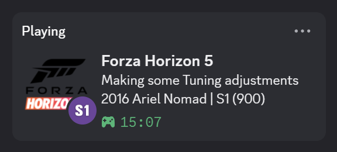
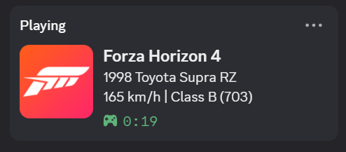

  <h1>Forza Horizon Discord Rich Presence</h1>
  
A simple app that shows what you are doing in Forza Horizon in your Discord status.

  

**Forza Horizon 6** ✅ Supported

**Forza Horizon 5** ✅ Supported

**Forza Horizon 4** ✅ Supported

## Linux Support
This fork adds Linux support for users running Forza via Steam + Proton.

**Tested on:** Arch Linux + KDE Plasma + Forza Horizon 6 via CachyOS Proton

Download `ForzaRichPresence.AppImage` or `ForzaRichPresence.deb` from [Releases](https://github.com/ZenithFluff/Forza-Horizon-Discord-Rich-Presence/releases).

> ⚠️ Only tested on Arch Linux + Forza Horizon 6. Other distros and Forza titles may vary.

## Installation

### AppImage (Recommended)
1. Download `ForzaRichPresence.AppImage`
2. Open a terminal and run:
``chmod +x ForzaRichPresence.AppImage``
./ForzaRichPresence.AppImage
   Or right click > Properties > mark as executable > double click

### .deb (Ubuntu/Debian/Mint)
1. Download `ForzaRichPresence.deb`
2. Run:
``sudo dpkg -i ForzaRichPresence.deb``

## Setup
1. Open Discord
2. In Forza, go to **Settings > HUD and Gameplay > Data Out**
   - Set IP to `127.0.0.1`
   - Set Port to `8001`
   - Enable Data Out
3. Launch the app
4. Start Forza. rich presence will appear automatically

### Windows
1. Download `ForzaRichPresence.exe`
2. Run it directly 

## Microsoft Store / Xbox App Users
Windows blocks UWP apps from sending data to local programs. If you play the Microsoft Store version, you need to apply a network fix:
- Click the **Fix Network** button in the app.
- Accept the Administrator prompt to add a Windows Loopback Exemption.
- You only need to do this **once**.

> ℹ️ Linux users do not need this fix.

## Features
- **Car Database Updates:** Click "Update Cars" to automatically fetch the latest car list from this repository.
- **Set & Forget:** Enable "Run on Startup" and "Launch Minimized" to let the app run silently in your system tray.
- **SimHub:** Fully compatible with SimHub and other software that uses your forza telemetry.
- **OpenXBL:** Update frequency is optimized to preserve your free API limits.
- **100% Safe:** No game file modifications or memory hooking/reading involved.

## Reporting Unknown Cars
⚠️ In Forza Horizon 6 some cars are not recognized because I don't have the database for them yet.
Please consider reporting missing cars **<ins>directly in the app</ins>** *(field for type the car name will appear when it detects an unknown car)* this will help speed up the process.

Feel free to submit a Pull Request as well (add cars in **src-tauri/cars.json**).

## Acknowledgements
- **CringeGaming** — for testing assistance during development
- **MrCoolAndroid** — author of [Xbox Rich Presence Discord](https://github.com/MrCoolAndroid/Xbox-Rich-Presence-Discord). Idea to use OpenXBL for the Rich Presence status
- **jaaiden** — author of [FH5RP](https://github.com/jaaiden/FH5RP) and [FH4RP](https://github.com/jaaiden/FH4RP). Idea to use telemetry for the Discord status
- **addidotlol** — author of [FH4-Car-ID-List](https://github.com/addidotlol/FH4-Car-ID-List). Initial FH4 car database
- **Tinase-nau** — author of [FH4-car-IDs](https://github.com/Tinase-nau/FH4-car-IDs). Updated FH4 car database
- **ForzaMods** — authors of [FH5-Car-ID-List](https://github.com/ForzaMods/FH5-Car-ID-List). FH5 car database
- **ZenithFluff** — Linux port
